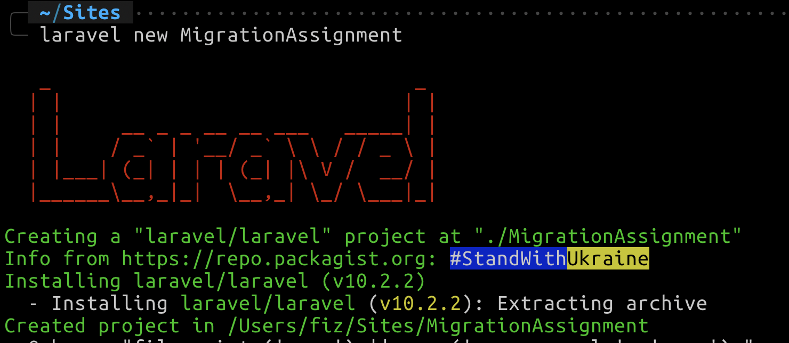
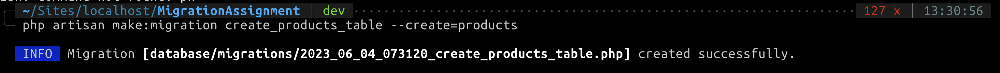

# Laravel Migration Assignment Documentation

This repository contains code for a Laravel migration assignment. It demonstrates the creation of migration files and the process of modifying database tables using Laravel's migration feature.

## Prerequisites

Before proceeding with the migration process, ensure that we have the following prerequisites installed:

- [PHP](https://www.php.net/manual/en/install.php) (version 8.1 or higher)
- [Composer](https://getcomposer.org/download/)
- [Laravel](https://laravel.com/docs/installation)

## Installation

1. Need to clone the repository in our local machine:

```shell
    git clone https://github.com/devhafix/MigrationAssignment.git
```

2. Need to change into the project directory:

```shell
    cd MigrationAssignment
```

3. Need to nstall the project dependencies:

```shell
    composer install
```

# Migration Process
I have followed these steps to perform the migration process:

### Task 1: Create a new Laravel project

Create a new Laravel project named "MigrationAssignment" using the Laravel command-line interface:

```shell
    laravel new MigrationAssignment
```



### Task 2: Create the "products" table migration

Within the project, create a new migration file named "create_products_table" responsible for creating the "products" table:

```shell
    php artisan make:migration create_products_table --create=products
```



Add the following code within the up() method:

```php
    public function up(): void
    {
        Schema::create('products', function (Blueprint $table) {
            $table->id();
            $table->string('name', 256);
            $table->decimal('price',10);
            $table->text('product_description');
            $table->timestamp('created_at')->useCurrent();
            $table->timestamp('updated_at')->useCurrentOnUpdate();
        });
    }
```

### Task 3: Run the "products" table migration

Run the migration to create the "products" table in the database:

```shell
    php artisan migrate
```

### Task 4: Modify the "products" table migration

Modify the existing migration file "create_products_table" to add a new column called "quantity" to the "products" table:

Run the following command to update and add quantity column to products table.

```shell
    php artisan migrate:rollback
```

Add the following code within the up() method, before the timestam lines:

```php
    $table->integer('quantity')->nullable();
```

```php
    public function up(): void
    {
        Schema::create('products', function (Blueprint $table) {
            $table->id();
            $table->string('name', 256);
            $table->decimal('price',10);
            $table->text('product_description');
            $table->integer('quantity')->nullable();
            $table->timestamp('created_at')->useCurrent();
            $table->timestamp('updated_at')->useCurrentOnUpdate();
        });
    }
```

Run the migration to create the "products" table in the database:

```shell
    php artisan migrate
```

### Task 5: Create the "category" column migration

Create a new migration file named "add_category_to_products_table" to add the "category" column to the "products" table:

```shell
    php artisan make:migration add_category_to_products_table --table=products
```

Add the following code within the up() method, before the timestamp lines:

```php
    $table->string('category', 50);
```

```php
    public function up(): void
    {
        Schema::table('products', function (Blueprint $table) {
            $table->string('category', 50);
        });
    }
```

### Task 6: Run the "category" column migration

Run the migration to add the "category" column to the "products" table:

```shell
    php artisan migrate
```

### Task 7: Create the "orders" table migration

Create a new migration file named "create_orders_table" responsible for creating the "orders" table:

```shell
    php artisan make:migration create_orders_table --create=orders
```

Add the following code within the up() method

```php
    public function up(): void
    {
        Schema::create('orders', function (Blueprint $table) {
            $table->increments('id');
            $table->unsignedBigInteger('product_id');
            $table->foreign('product_id')->references('id')->on('products');
            $table->integer('quantity');
            $table->timestamp('created_at')->useCurrent();
            $table->timestamp('updated_at')->useCurrentOnUpdate();
        });
    }
```

### Task 8: Run the "orders" table migration

Run the migration to create the "orders" table in the database:

```shell
    php artisan migrate
```
That's it! We have completed the Laravel migration process.